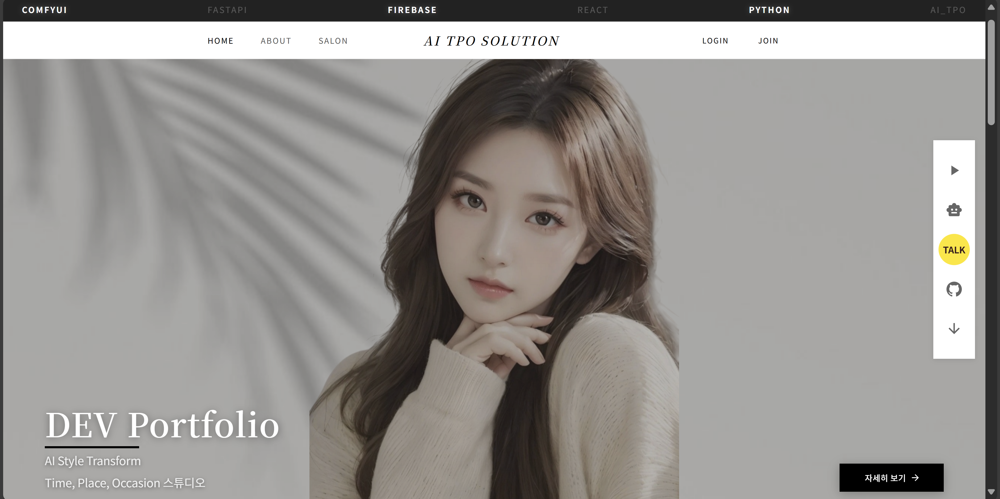
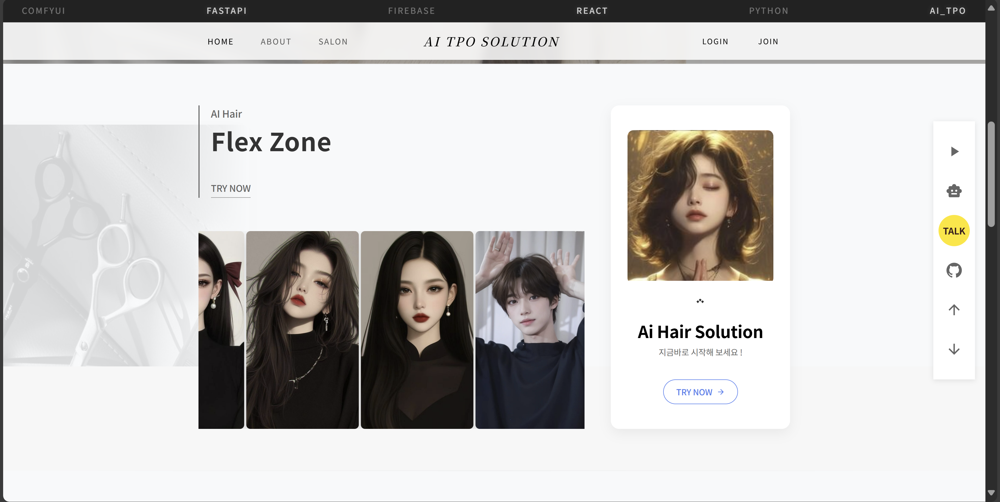
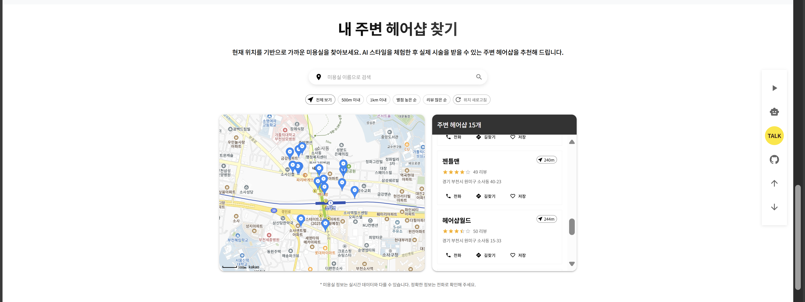
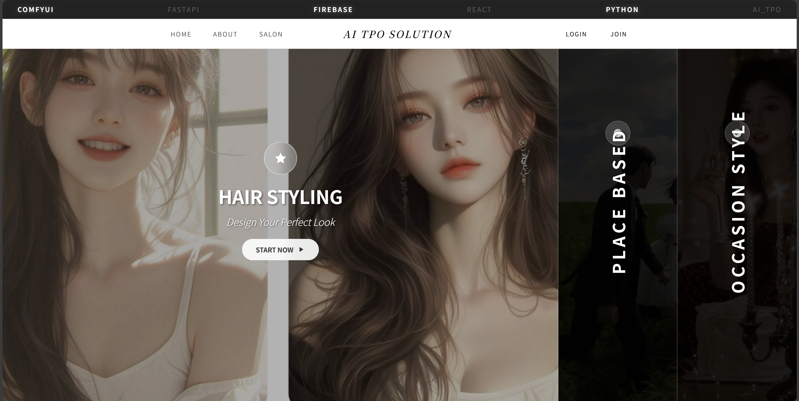
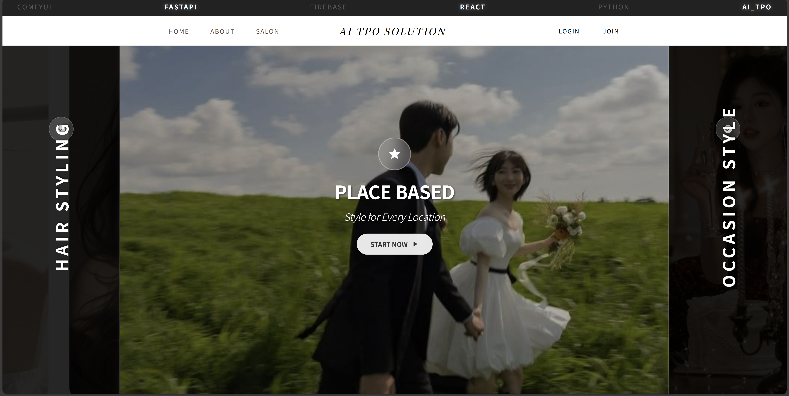
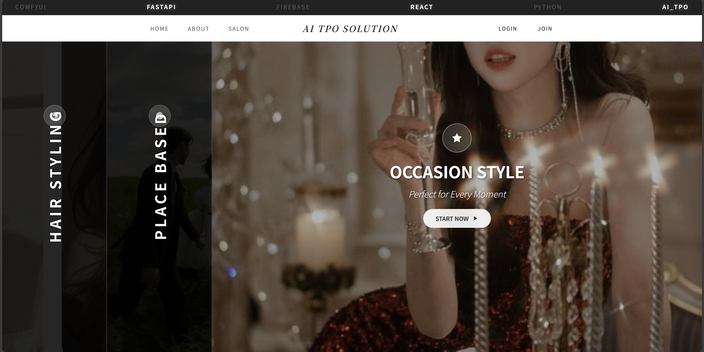

# AI TPO - Full Stack Project



## 📱 프로젝트 소개
AI TPO은 AI 기술을 활용하여 사용자에게 스타일을 추천하고 시뮬레이션해주는 웹 애플리케이션입니다. 
5년간의 미용 현장 경험을 바탕으로 개발된 이 서비스는 사용자의 개인적 특성을 분석하여 최적의 헤어스타일을 제안합니다.

### 🏠 메인 페이지



## ✨ 핵심 기능

### 1. TPO(Time, Place, Occasion) 맞춤 추천 시스템

#### 🎨 헤어스타일 추천 서비스
개인의 얼굴형, 라이프스타일, 선호도를 분석하여 최적의 헤어스타일을 추천합니다.


#### 📍 장소별 맞춤 스타일 추천
직장, 데이트, 파티, 일상 등 다양한 장소와 상황에 어울리는 헤어스타일을 제안합니다.


#### ⏰ 시간대별 스타일 추천
낮, 저녁, 새벽 등 시간대에 따라 적합한 헤어스타일을 추천합니다.


### 2. AI 챗봇 상담 (서비스 구현 완료)
- AI 기반 스타일 어시스턴트와 실시간 채팅
- 개인 맞춤형 스타일 추천 및 상담 제공
- 날짜별 상담 기록 저장 및 조회 기능
- 빠르고 간편한 스타일 조언 서비스

### 3. 헤어스타일 룩북 & 티커 슬라이더 (서비스 구현 완료)
- 다양한 헤어스타일을 쉽게 탐색할 수 있는 룩북 기능
- 자동으로 슬라이딩되는 티커 슬라이더로 트렌드 스타일 소개
- 카테고리별 필터링 및 정렬 기능

### 4. 카카오 채널 상담 기능 (서비스 구현 완료)
- 카카오톡을 통한 실시간 상담 서비스
- 로그인 사용자를 위한 개인화된 상담 기능
- 간편한 UI/UX로 접근성 향상

### 5. 주변 헤어샵 찾기 (서비스 구현 완료)
- 사용자 위치 기반 주변 미용실 정보 제공
- 카카오맵 API 연동으로 정확한 위치 정보 표시
- 미용실 필터링 및 상세 정보 확인 기능

## 🛠️ 기술 스택

### Front-End
- **React.js**: UI 컴포넌트 구현
- **Material-UI**: 디자인 시스템 및 UI 프레임워크
- **Styled Components**: 컴포넌트 스타일링
- **React Router Dom**: 클라이언트 사이드 라우팅

### Back-End
- **Firebase**
  - Authentication: 사용자 인증
  - Firestore: 데이터베이스
  - Hosting: 웹 애플리케이션 호스팅
- **FastAPI**: AI 챗봇 및 커스텀 API 서비스

### AI 및 외부 API
- **Gemini API**: AI 스타일 상담 챗봇
- **ComfyUI**: AI 이미지 생성 백엔드
- **Kakao Maps API**: 지도 서비스
- **Kakao Login API**: 소셜 로그인
- **Kakao Channel API**: 채널 상담

## 🏗️ 시스템 아키텍처

```
┌─────────────────┐    ┌─────────────────┐    ┌─────────────────┐
│   React.js      │    │   Firebase      │    │   FastAPI       │
│   Frontend      │◄──►│   Backend       │◄──►│   AI Service    │
│                 │    │                 │    │                 │
│ • UI Components │    │ • Authentication│    │ • Gemini API    │
│ • State Mgmt    │    │ • Firestore DB  │    │ • ComfyUI       │
│ • Routing       │    │ • Hosting       │    │ • Custom APIs   │
└─────────────────┘    └─────────────────┘    └─────────────────┘
        │                       │                       │
        └───────────────────────┼───────────────────────┘
                                │
                    ┌─────────────────┐
                    │  External APIs  │
                    │                 │
                    │ • Kakao Maps    │
                    │ • Kakao Login   │
                    │ • Kakao Channel │
                    └─────────────────┘
```

## 📂 프로젝트 구조
```
AI_TPO/
├── public/
├── src/
│   ├── components/     # React 컴포넌트
│   ├── pages/         # 페이지 컴포넌트
│   ├── services/      # API 서비스
│   ├── hooks/         # 커스텀 훅
│   ├── utils/         # 유틸리티 함수
│   └── styles/        # 스타일 파일
├── images/            # 프로젝트 이미지
└── README.md
```

## 🚀 프로젝트 실행 방법

### 설치
```bash
npm install
```

### 개발 서버 실행
```bash
npm start
```

### 빌드
```bash
npm run build
```

## 🔮 향후 개발 계획
- AI 챗봇의 스타일 분석 정확도 향상
- 모바일 애플리케이션 버전 개발
- 더 정확한 AI 헤어스타일 시뮬레이션과 TPO 스타일을 위한 시뮬레이션 
- 미용실 예약 시스템 통합 
- 사용자 리뷰 및 커뮤니티 기능 확장
- 다국어 지원

## 📱 주요 특징
- **반응형 디자인**: 모든 디바이스에서 최적화된 사용자 경험
- **실시간 AI 상담**: 즉시 응답하는 AI 스타일리스트
- **개인화된 추천**: 사용자 맞춤형 스타일 제안
- **직관적인 UI/UX**: 쉽고 편리한 인터페이스

## 👨‍💻 개발자 정보 (개인 사이드 프로젝트)
**최재원**
- 풀스택 개발자
- 5년간의 미용 현장 경험을 바탕으로 한 전문성
- **연락처**: 010-3161-4032
- **이메일**: cjw4032@gmail.com
- **블로그**: [Velog](https://velog.io/@cjw4032/posts)
- **유튜브**: [낑달달하누](https://www.youtube.com/@%EB%82%91%EB%8B%AC%EB%8B%AC%ED%95%98%EB%88%84)

---

> 💡 **AI TPO**는 기술과 미용 전문성을 결합하여 개인에게 최적화된 스타일링 솔루션을 제공합니다.